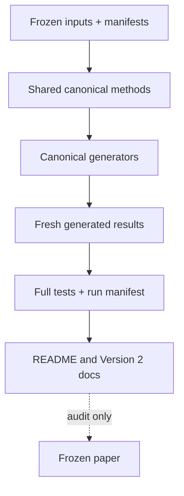

# Repository architecture map

| Layer | Canonical location | Responsibility | Current state |
|---|---|---|---|
| Shared methods | `scripts/_canonical.py` | Parsing, classification, ambiguity, sequence boundaries, transitions, clustering, affix discovery, matched-unit and grouped-block sampling | Canonical |
| Frozen inputs | `data/raw/`, `data/manifests/` | Immutable corpora, provenance, checksums | Canonical inputs |
| Pipeline entry | `run_all.py` | Ordered canonical execution, freshness checks, input/output hashes, run manifest | Canonical |
| Core generator | `scripts/01_core_analysis.py` | Within-line transition and core descriptive results | Canonical after regeneration |
| Ambiguity generator | `scripts/21_ambiguity_audit.py` | Exact overlap and precedence-disagreement report | Canonical |
| Prefix/suffix generator | `scripts/10_prefix_suffix_analysis.py` | Matched-size, repeated, boundary-aware symmetric affix estimator and generated tables/figure | Canonical Version 2 estimator |
| Test reporter | `scripts/22_generate_test_report.py` | Pytest plus direct execution, JSON and JUnit evidence | Canonical |
| Provisional analyses | Other numbered analysis scripts | Historical, exploratory, narrowed, or awaiting shared-method migration | Not canonical unless ledger says otherwise |
| Current outputs | `results/*.json` named by `run_all.py` | Generated evidence only | Canonical when fresh in run manifest |
| Provisional outputs | Other `results/*.json` | July audit outputs pending method repair | Provisional |
| Historical outputs | `results/archive/` | Obsolete/precomputed/method-mismatched artifacts | Archived |
| Current governance | `docs/v2/`, root `README.md` | Status, issue ledger, architecture, claims | Canonical prose |
| Manuscript | `docs/main.tex` | Audited paper awaiting later revision | Frozen, noncanonical claims |
| Historical record | `docs/archive/` | Prior papers, audits, retractions, closure documents | Preserved, noncanonical |

## Dependency flow

